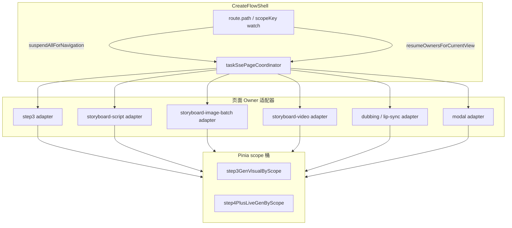

# 创作流程 SSE 页面调度器设计

> 日期：2026-07-24  
> 状态：已确认（用户 2026-07-24 审阅通过；含配音/对口型）  
> 关联：`components/steps/SSE跨步骤任务管理排查报告.md`、`弹窗生成任务-跨作品切换状态同步方案.md`  
> 规范：`docs/2026-07-22-frontend-development-standards.md`、`docs/2026-07-22-existing-code-safe-remediation.md`

---

## 1. 问题与目标

### 1.1 现象

用户在任一生成任务进行中，切换创作步骤、切换作品或切换剧集后：

1. 偶发弹出中文或英文「任务中断 / Task SSE aborted」类提示  
2. 返回原步骤后 **loading 仍在，但不再请求 `/api/user/task/stream/{taskId}`**  
3. 只能刷新浏览器才能恢复跟进  
4. 多类生成均会出现（第三步、分镜脚本/图、视频、配音对口型、弹窗等）

### 1.2 根因（架构级）

| 根因 | 说明 |
|------|------|
| 无统一所有者 | 断连与重连分散在壳层、各步骤、各 batch composable、各弹窗 |
| 脏闸门挡死重连 | `activeTaskStreamClosers` / `followInFlight` / `hasModalFollowLock` 等误判「仍在 follow」 |
| 良性断连当失败 | abort 英文底层错误未全覆盖，部分路径 `message.error` |
| 切页与切 scope 恢复入口不齐 | 纯切步骤不一定派发 scope-changed；`useCreateFlowLiveGenResume` 主函数未接入 |
| 剧集/作品隔离意图有、契约不完整 | Pinia 有 scope 桶，但 SSE suspend/resume 与闸门未统一按 scope 强制 |

**结论**：不是再补几个 if，而是补「当前页 + 当前 scope」的唯一 SSE 调度契约。

### 1.3 目标

1. **任务不断、连接按页挂起**：切走只断浏览器 SSE，不取消服务端任务（除非用户点停止）  
2. **切回必重连**：返回有进行中任务的当前流程页时，必定重新订阅 SSE（除非服务端已终态）  
3. **同时只连当前可见页**（第三步再加当前 Tab）：避免多步骤多路 SSE 常驻  
4. **作品 + 剧集不污染**：`scopeKey = projectId:episodeId`  
5. **挂起/抢占静默**：不再弹中英「中断失败」toast  
6. **分批绞杀接入**：不大爆炸重写；旧 API 短期兼容可回滚  

### 1.4 非目标（本设计不做）

- 不改后端任务协议、不改 cancel/stop 业务语义（配音对口型改为 SSE 时，仍以服务端最终协议为准）  
- 不一次重写 `SceneCharacterProp.vue` / `EditStoryboardDubbingModal.vue` 等巨石文件全部逻辑  
- 不要求切回后自动打开编辑弹窗（可静默跟进度；打开弹窗时共享同一 follow）  

---

## 2. 产品契约（已确认）

### 2.1 三维隔离

```text
可见性 = 当前创作步骤（+ 第三步 Tab）
作用域 = projectId + episodeId
连接   = 仅当「可见性匹配」且「作用域匹配」时允许 SSE
```

| 用户动作 | 浏览器 SSE | Pinia loading / taskId | 服务端任务 |
|----------|------------|------------------------|------------|
| 切到其它步骤 | **suspend（断开）** | 保留在原 scope 桶 / 流程条可仍显示该 scope 的 generating | 继续 |
| 切到其它作品 | **suspend** | 旧作品写入旧 scope；当前展示新作品桶 | 继续（挂在旧作品） |
| 切到同作品其它剧集 | **suspend** | 旧集写入旧 `projectId:episodeId`；当前展示新集桶 | 继续（挂在旧集） |
| 回到原步骤且 scope 一致 | **resume（重连）** | 恢复展示 | 继续或已终态 |
| 用户点停止 | close + 调 cancel API | 按现有 stop 清 loading | 取消 |

### 2.2 多步骤同时有任务

允许：**多个步骤各自有进行中的后端任务**。  
禁止：**多个步骤同时占用浏览器 SSE**。

切回哪一步，只重连那一步（及该步策略允许的任务集合）。

### 2.3 剧集与作品同级

第 1 集与第 2 集视为两个 scope，规则与切作品完全一致，禁止：

- 集 A 的 SSE progress 写入集 B 的扁平 store  
- 切到集 B 时仍挂着集 A 的 `/task/stream`  
- 集 B 的 restore 清掉或改写集 A 桶内 taskId/loading  

---

## 3. 架构设计

### 3.1 总览



### 3.2 核心模块

建议新增（名称可微调，职责固定）：

| 模块 | 职责 |
|------|------|
| `utils/createFlowSsePolicy.ts` | 纯函数：当前路由/Tab 是否允许某 `ownerKind` 建连 |
| `utils/taskSsePageCoordinator.ts`（或 composable） | 登记表、suspend、resume、存活探测、静默策略入口 |
| `composables/useCreateFlowSseNavigation.ts` | 壳层：path/scope 变化时调用 suspend → 下一帧 resume |
| 各 `*SseOwnerAdapter` | 薄适配：把现有 restore/startTrack/cancelResume 接到 coordinator |

**原则**：业务成功/失败/取消逻辑仍在原有 follow 实现里；coordinator **只拥有连接生命周期与重连决策**。

### 3.3 登记条目（Registry Entry）

```ts
type CreateFlowSseOwnerKind =
  | 'step3-form-image'
  | 'step3-extract'
  | 'storyboard-script'
  | 'storyboard-image-batch'
  | 'storyboard-video-batch'
  | 'storyboard-audio-batch' // 配音批量（含将改为 SSE 的路径）
  | 'modal-scene'
  | 'modal-storyboard-image'
  | 'modal-storyboard-video'
  | 'modal-storyboard-dubbing' // 编辑分镜配音弹窗（对口型后期走 SSE）
  // 禁止旁路私建连接表；新种类只能加进本联合类型

type CreateFlowSseRegistration = {
  taskId: number
  scopeKey: string // `${projectId}:${episodeId}`
  ownerKind: CreateFlowSseOwnerKind
  /** 第三步 Tab；其它 owner 可空 */
  tab?: 'scene' | 'character' | 'prop'
  /** 可选：分镜 id / assetId，便于 resume 过滤 */
  targetIds?: number[]
}
```

登记时机：

- 提交任务成功拿到 `taskId` 后立刻 register（写入 Pinia 的同时写 coordinator，或由 Pinia 派生 + owner 声明）  
- 刷新 hydrate / task list 发现进行中任务时 ensureRegistered  

注销时机：

- 服务端终态已结算成功/失败/取消  
- 用户明确 stop 且本地收尾完成  

**禁止**：仅因切步骤/切集/切作品而 unregister。

### 3.4 suspend / resume 语义

#### suspend（导航离开或 scope 将变）

1. 对所有**当前活连接**调用 close（经统一 slot.abort）  
2. 标记连接状态为 `suspended`，**不得**把 abort 映射为业务 `FAILED`  
3. **不得**清除 Pinia scope 桶中的 taskId / generating  
4. **不得** `message.error` / `message.warning` 提示「中断」  
5. 第三步本地 `activeTaskStreamClosers` 等必须清空**死连接**条目，避免「假存活」

#### resume（进入匹配页且 scope 稳定）

1. 读取当前 `scopeKey` + 当前步骤（+ Tab）  
2. 过滤登记表：`scopeKey` 匹配且 `createFlowSsePolicy` 允许  
3. 对每个候选 taskId：  
   - 若服务端已终态 → 走现有 settle，不建连  
   - 若连接**真实存活**（统一探测，见 3.5）→ 跳过  
   - 否则 **强制** `startFollow`（无视旧 inFlight / stale closer / modal lock 的「假忙」）  
4. 同一 taskId 全局仍只允许一条 SSE（沿用 `waitUserTaskSseTerminal` 单槽抢占，抢占结果为 `superseded`，静默）

#### 顺序（壳层）

```text
scope 或 path 变化（sync）
  → coordinator.suspendAllBrowserFollows({ reason: 'navigation' })
  → （组件卸载可继续本地 cleanup，但不得再 toast、不得清异 scope 桶）
  → hydrate / apply 当前 scope 扁平态
  → nextTick / 短 debounce 后 coordinator.resumeForCurrentView()
```

### 3.5 「流是否存活」唯一判定

废弃「只要 Map 里有 closer / inFlight 非空就视为在 follow」作为**唯一**依据。

统一规则：

```text
alive =
  coordinator 登记的 liveSlot 存在
  AND slot.superseded === false
  AND stream.closed !== true
  AND stream 归属当前 scopeKey
```

若 closer Map 有条目但 stream 已 closed / aborted → **视为死连接**，必须 delete 后允许 resume。

各业务 restore gate 改为：

```ts
if (coordinator.isLive(taskId, scopeKey)) skip
else forceReconnect
```

### 3.6 静默断连白名单（统一一处）

收敛到 `isBenignTaskSseDisconnectMessage`（或由其包装的 `shouldSilentSuspendSseError`），至少覆盖：

- `Task SSE aborted` / `AbortError` / `signal is aborted`  
- `Task SSE ended unexpectedly` / `rate limited` / `superseded`  
- `任务连接中断` / `任务连接异常` / `已切换作品…` / `任务仍在后台执行…`  
- `Task SSE error`（仅当伴随 navigation suspend / closed 上下文时静默；真实业务 error 事件仍走失败）  
- `Task SSE read failed` / `SSE HTTP *`：若发生在 suspend 窗口内静默；否则按现有失败路径  

**硬规则**：`reason === 'navigation' | 'scope-change' | 'tab-pause' | 'superseded'` 触发的 close，调用方 **禁止 toast**。

### 3.7 与现有 Pinia / 事件的关系

| 现有机制 | 新设计中的角色 |
|----------|----------------|
| `step3GenVisualByScope` / `step4PlusLiveGenByScope` | 继续作为 loading/taskId 持久化真相源 |
| `CREATE_FLOW_SCOPE_CHANGED_EVENT` | 保留；由壳层 navigation hook **保证**在 path 变化与 scope 变化后都会触发（或直接调 coordinator.resume，事件作兼容广播） |
| `useCreateFlowLiveGenResume` | 接入壳层，或合并进 `useCreateFlowSseNavigation`，消除「写了未用」 |
| `suspendAllTaskSseFollows` | 成为 coordinator.suspend 的实现细节之一，不再散落业务语义 |
| 各 `restore*IfNeeded` | 改为 owner adapter 的 resume 实现，入口先问 policy + coordinator |

---

## 4. 分 Owner 行为

### 4.1 第三步（场景/角色/道具）

- 切步骤离开：suspend 本页全部 SSE；**保留** Pinia 与（可迁到 Pinia/session 的）task↔tab 元数据，避免完全依赖 list 猜 Tab  
- 切 Tab：仅当前 Tab 可连（现有互斥保留，纳入 coordinator）  
- 切回步骤：resume 当前 Tab 任务；其它 Tab 只保留登记与卡片 loading  
- `stopOngoingTaskStreamForRouteContextChange`：仅用于 **scope 切换** 时清「当前页内存态」；**不得**在纯切步骤时清空导致无法 resume 的元数据（或清空后必须能从 Pinia/list 完整重建）

### 4.2 分镜脚本 / 分镜图 batch / 分镜视频 batch

- 单例与多实例：同一 `ownerKind` 在壳层与步骤页必须共享同一 follow 控制面（脚本已有 singleton；图/视频需对齐，避免双实例抢连）  
- `cancelResumeFollow` = suspend（增 generation + close），**必须**结束假 inFlight，或 resume 时无视假 inFlight  
- 壳层 bootstrap：**禁止**在非脚本页主动连脚本 SSE（loading 条可亮，连接等进页再连）——与「只连当前页」一致  

### 4.3 配音 / 对口型（纳入本期）

背景：配音步骤与 `EditStoryboardDubbingModal` 当前大量走 **compose 批次轮询**；产品确认 **编辑分镜配音弹窗中的对口型后期改为 SSE**。因此配音必须接入同一套页面调度器，不能留在「二期旁路」。

规则：

1. **可见性**：仅 `/create/dubbing`（及该步打开的配音弹窗）允许建立配音相关 SSE；切走 suspend，切回 resume  
2. **作用域**：同样按 `projectId:episodeId` 隔离；切集不得串 loading / 进度  
3. **协议过渡**：  
   - 对口型改为 SSE 后：`ownerKind = modal-storyboard-dubbing`（弹窗）+ 步骤页批量用 `storyboard-audio-batch`，一律走 coordinator  
   - 过渡期内若仍有 compose 轮询：也必须遵守「离开暂停、回来续跟、按 scope 隔离」；**不得**与 SSE 双开抢同一业务 loading  
4. **Pinia**：现有 `composeBatchId` / 配音 generating 字段迁入或并存于 step4+ scope 桶时，resume 以「当前协议」解析 taskId 或 batchId；SSE 落地后以 `taskId` 为准登记  
5. **弹窗**：对口型生成中切步骤/切集 → suspend；回配音步 → 外层或弹窗 resume，禁止「有对口型 loading 无人跟进」

### 4.4 其它编辑弹窗（场景图 / 分镜图 / 分镜视频等）

- 弹窗打开：resume 该弹窗相关 task  
- 弹窗关闭但步骤页仍在：可选 **静默 follow**（不强制开窗），用于外层卡片进度；若暂不做，则步骤页 outer restore 必须能跟 modal 登记的 task（避免「外层 loading、无人跟 SSE」）  
- 切作品/切集：suspend；锁 `hasModalFollowLock` 必须随 suspend 释放或标记可抢占  

---

## 5. 接入计划（绞杀者，小步）

遵守《现有代码安全整改方案》：一次一类事；高风险区可回滚；功能与大重构不混。

| 阶段 | 内容 | 验收焦点 |
|------|------|----------|
| **P0** | coordinator + policy + 静默策略 + 壳层 navigation suspend/resume 骨架；不改业务结算 | 切步/切集只断连不 toast |
| **P1** | 接入第三步 `startTrackTask` / restore；修复假 closer | 第三步来回切 + 切集不卡死 |
| **P2** | 接入分镜脚本 + 分镜图 batch；壳层不再越权连脚本 SSE | 脚本/图页来回切不卡死 |
| **P3** | 接入分镜视频 batch | 视频页同上 |
| **P4** | 接入配音步骤 + 配音弹窗：先统一 suspend/resume 契约；对口型切 SSE 时直接挂 coordinator | 配音/对口型来回切 + 切集不卡死；无 compose+SSE 双跟 |
| **P5** | 接入其余编辑弹窗 owner（或步骤页 outer 静默跟 modal task） | 弹窗外 loading 也能续跟 |
| **P6** | 删除重复闸门/死代码；补单测（policy / alive / silent / dubbing policy） | 回归全矩阵（含配音） |

每阶段独立可合并；未接入的 owner 保持旧路径，但壳层 suspend 已统一，避免新旧双 toast。

---

## 6. 验收用例（手工 + 可单测部分）

### 6.1 矩阵（每类生成至少跑一遍）

前置：作品 A 第 1 集启动生成，Network 可见 `/task/stream/{id}`。

| ID | 操作 | 期望 |
|----|------|------|
| N1 | 切到其它步骤再切回 | 离开时 SSE 断开；无失败 toast；回来必有新 stream；loading 连续直至终态 |
| N2 | 打开作品库切到作品 B 再回 A 同一步骤 | B 无 A 的 stream；回 A 后重连；B 状态未被 A 污染 |
| N3 | 同作品切到第 2 集再回第 1 集 | 与 N2 同级隔离；第 2 集不显示第 1 集卡片 loading |
| N4 | 多步骤同时有任务，在步骤间频繁来回 | 任意时刻 Network 仅当前步骤相关 SSE；每次回到有任务步骤都能重连 |
| N5 | 任务已成功后再切回 | 不重连空 SSE；loading 清除；展示结果 |
| N6 | 用户点停止 | cancel API + 清 loading；不再 resume 该 taskId |
| N7 | 刷新停留在有任务的当前页 | 仅当前页（+ 当前 Tab）重连 |
| N8 | 配音/对口型生成中切步骤或切集再返回 | 离开断跟进；无失败 toast；返回后按当前协议续跟（SSE 或过渡期 compose）；loading 不跨集污染 |

### 6.2 失败即不合格

- 出现 `Task SSE aborted` / `任务连接中断` 等作为 **error toast**（导航场景）  
- 返回后 loading ≥3s 仍无 `/task/stream` 且服务端任务仍为进行中  
- 集/作品间 loading 或进度串台  

### 6.3 建议单测（纯函数）

- `shouldConnectTaskSseForCurrentView` 步骤/Tab/scope 矩阵  
- `isBenignTaskSseDisconnectMessage` / navigation silent 规则  
- `isLiveFollow` 对 closed/stale closer 判定  

---

## 7. 风险与缓解

| 风险 | 缓解 |
|------|------|
| 巨石文件改动面大 | 只在 follow/restore/unmount 边界接 adapter；禁止顺手大重构 UI |
| 双实例 composable 抢连 | P2 起统一 singleton 或强制经 coordinator 单槽 |
| resume 风暴（频繁切换） | debounce（现有 48～64ms 量级）+ 已有 connect rate limit；超限静默并短延迟再试一次 |
| 旧闸门与 coordinator 冲突 | resume **强制**清假存活；阶段内加诊断 log（可开关），定位后删除 |

---

## 8. 决策记录

| 决策 | 选择 | 理由 |
|------|------|------|
| 多步骤任务并存时 SSE 策略 | 离开断开、回来重连 | 避免多路常驻与串写；后端任务不丢 |
| 剧集隔离 | 与作品同级 `projectId:episodeId` | 防止集间污染 |
| 实现策略 | 统一调度器 + 绞杀接入 | 多轮局部补丁已失败；需唯一所有者 |
| 弹窗 | 一期允许步骤页静默跟；不强制自动开窗 | 解决外层 loading 卡死，少打扰 |
| 配音/对口型 | **纳入本期**；对口型后期改 SSE，先挂同一调度契约 | 避免配音成为唯一旁路，再次出现「有 loading 无跟进」 |

---

## 9. 审阅清单（请确认）

- [ ] 同意「任务不断、连接按页/按 scope 挂起」  
- [ ] 同意剧集与作品同一套隔离  
- [ ] 同意配音/对口型纳入本期（含后期 SSE 改造走同一 coordinator）  
- [ ] 同意分阶段 P0→P6 接入顺序  
- [ ] 无其它必须一期纳入的生成类型（若有请注明）  

审阅通过后，再输出实现计划（`docs/superpowers/plans/...`）并开工。
